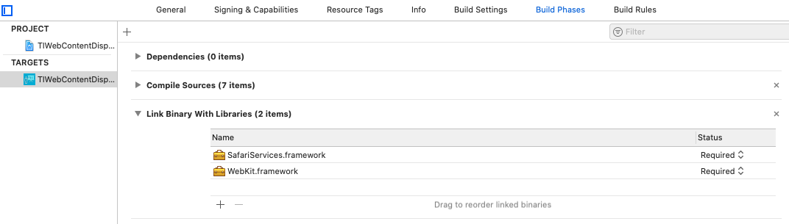
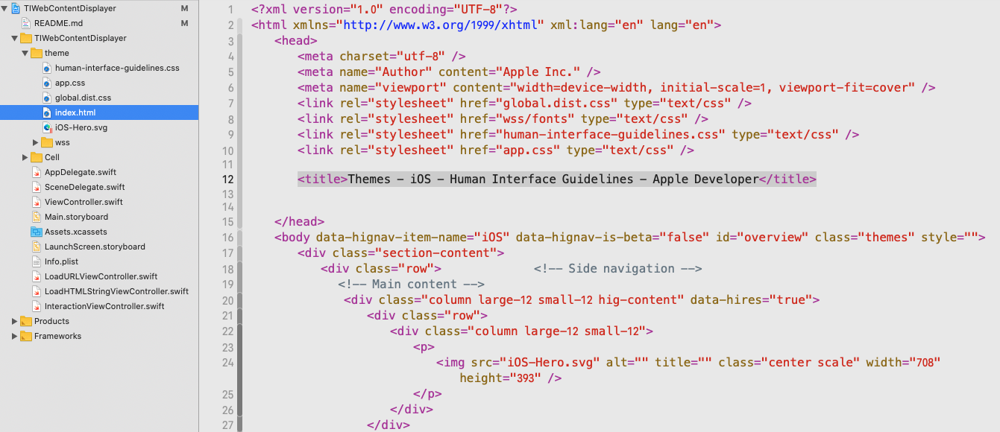
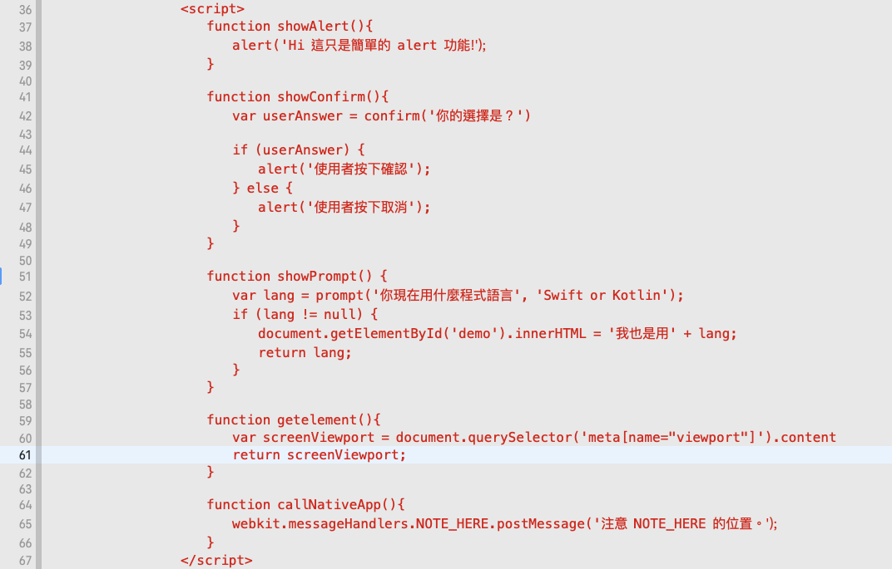
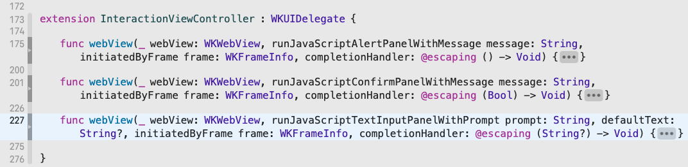
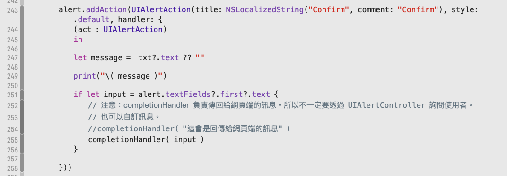
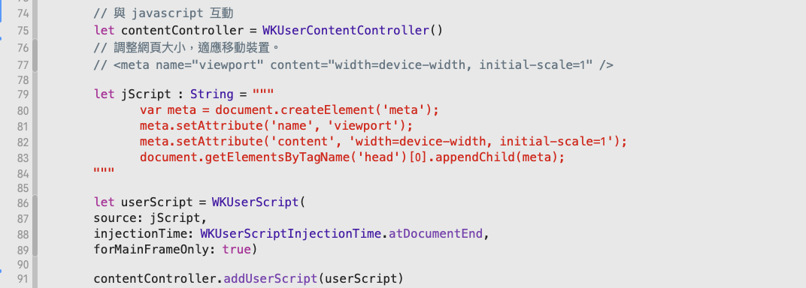
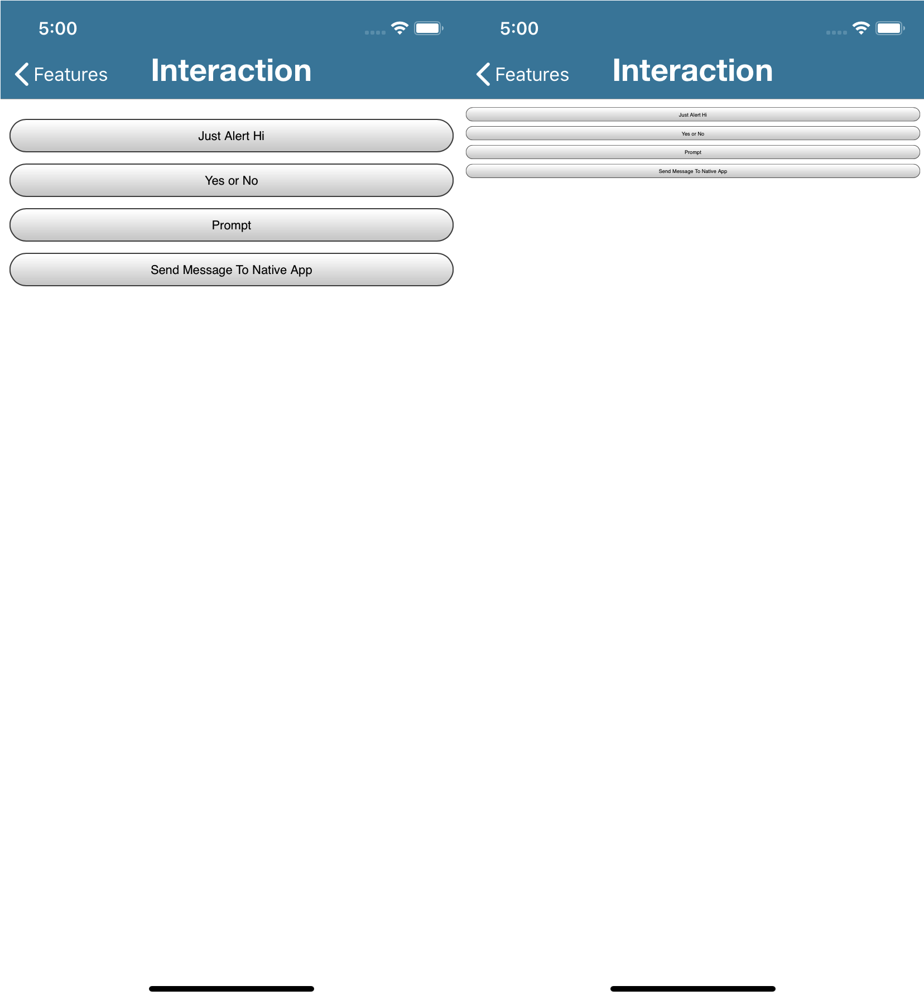
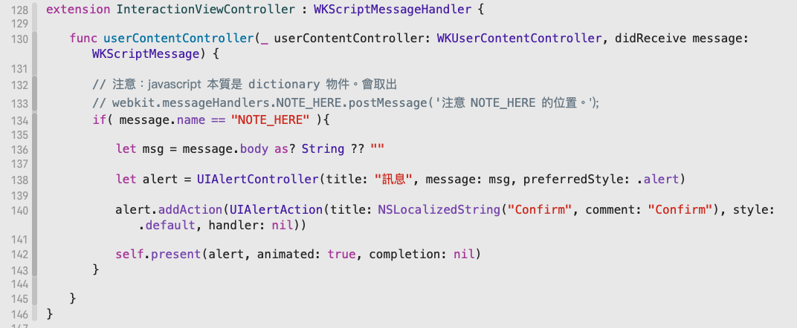
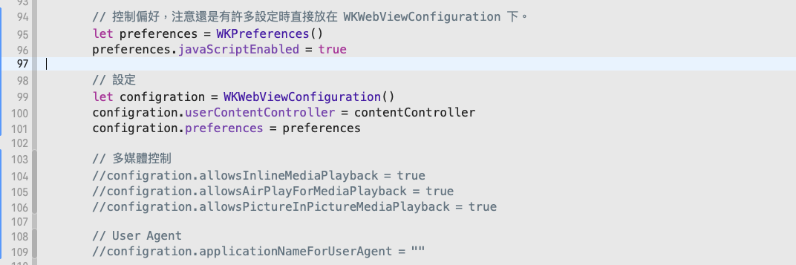

# Swift 使用 WKWebView 各項功能 

## 前言

在使用 App 時，有許多情境，會需要以網頁作為內容

譬如一個短期活動，如果使用原生 Native 的開發方式，與純網頁相較，在成本和時間上並沒有多大的優勢可是好不容易「導流」使用者使用 App ，若是又讓使用者跳出我們設計的使用情境，去使用瀏覽器
在許多的調查都告訴我們，一段時間內，使用者不會再回來我們所設計的 App所以如果需要使用網頁內容時，還是會希望將使用情境置於我們開發的 App 中

這時，我們就可以使用 WKWebView 以及 SFSafariViewController 來呈現內容。

而如果需要對「互動」有更多的控制，可以使用 WKWebView 下幾個 delegate 定義的功能。

## 專案敘述

專案內示範幾項功能：
使用 WKWebView 以 URL 載入遠端網頁內容。
使用 WKWebView 載入 HTML
使用 WKWebView 與容器互動。
使用 SFSafariViewController 直接顯示網頁內容。

### 專案需要引用兩個 framework

- WebKit framework
- SafariServices framework



所以在程式碼內也需要引用

```swift
import UIKit
import WebKit
import SafariServices

```
## 功能

### load Url

如果單純需要載入遠端網頁，可以使用 WKWebView 與 SFSafariViewController。

- WKWebView

  ```swift
  self.myWebView.load(URLRequest(url: URL(string: "https://developer.apple.com")!))

  ```

  範例在 [LoadURLViewController.swift]((TIWebContentDisplayer/LoadURLViewController.swift))

- SFSafariViewController
  
  ```swift
  let safari = SFSafariViewController( url: URL(string: "https://google.com")!)
  
  self.present(safari, animated: true, completion: nil)
  ```

  範例在 [ViewControll.swift](TIWebContentDisplayer/ViewController.swift)

### load HTML

如果需要載入 HTML 內容。就需要使用 WKWebView。
只需要直接傳入 HTML 字串即可。

在範例中，為了迴避 relative 的問題。所以我將 Apple 的 Human Interface Guildlines 的首頁內容去除 javascript 後，保留 css 當成專案內容。然後都放上同一目錄下。




程式碼：

```swift
// 取得網頁位置
let htmlPath = Bundle.main.path(forResource: "index", ofType: "html")

// 取得資源的 relative 目錄
let folderPath = Bundle.main.bundlePath
let baseUrl = URL(fileURLWithPath: folderPath, isDirectory: true)

// 讀取 HTML 字串後，以 WKWebView 載入。
do {
    let htmlString = try NSString(contentsOfFile: htmlPath!, encoding: String.Encoding.utf8.rawValue)
     myWebView.loadHTMLString(htmlString as String, baseURL: baseUrl)
} catch {
    print(error.localizedDescription)
}
```
測試的時候，可以橫置 iPhone、iPad 或是設定 baseURL 為 nil 以觀看 css 的作用。

### 與網頁內容互動

與網頁內容互動，會需要用到幾個 delegate
至於要執行 javascript 也非常簡單。

為了簡單化，我直接載入 HTML 字串傳入 WKWebView

請注意 javascript 的寫法除了傳出網頁外，都是一般的寫法。



#### WKNavigationDelegate

這是用來管理 WKWebView 的網誌跳轉事件。
比較重要的是「網頁開始載入」與「網頁載入完畢」。

- 網頁開始載入
didCommit
- 網頁載入完畢
didFinish

```swift
extension LoadURLViewController : WKNavigationDelegate {

    // when content starts arriving for the main frame.
    func webView(_ webView: WKWebView, didCommit navigation: WKNavigation!) {
        print("didCommit")
    }

    // when a main frame navigation completes.
    func webView(_ webView: WKWebView, didFinish navigation: WKNavigation!) {
        print("didFinish")
    }
}
```

在範例 [LoadURLViewController.swift](TIWebContentDisplayer/LoadURLViewController.swift) 中，我使用網頁內容較複雜的 Apple 開發者網站。顯示這兩個事件的時間差。

```swift
self.myWebView.navigationDelegate = self
self.myWebView.load(URLRequest(url: URL(string: "https://developer.apple.com")!))
```

注意，別忘記設定 navigationDelegate。


#### SFSafariViewControllerDelegate

一樣需要設定 delegate
```swift
    let safari = SFSafariViewController( url: URL(string: "https://google.com")!)
    safari.delegate = self
    self.present(safari, animated: true, completion: nil)
```
SFSafariViewController 只負責載入網頁，所以 delegate 的設計較為簡單。
以開始載入與結束載入較為常用。 

```swift
extension ViewController : SFSafariViewControllerDelegate {

    func safariViewController(_ controller: SFSafariViewController, initialLoadDidRedirectTo URL: URL) {
        print("initialLoadDidRedirectTo:\( URL.absoluteString )")
    }

    func safariViewController(_ controller: SFSafariViewController, didCompleteInitialLoad didLoadSuccessfully: Bool) {
        print("didCompleteInitialLoad")
    }
}
```
範例在 [ViewControll.swift](TIWebContentDisplayer/ViewController.swift)
    
#### WKUIDelegate
   
WKUIDelegate 的作用是管理網頁常見的 javascript function：alert、confirm、prompt以及右鍵選單。

範例在 [InteractionViewController.swift](TIWebContentDisplayer/InteractionViewController.swift)

    


在使用時，請注意在 confirm 與 prompt 的互動中。completionHandler 是要有傳回值。
confirm 是回傳 true/false 而 prompt 是要回傳字串。

例如在 prompt 範例中，我是使用 UIAlertController 內的 UITextField 取值。
可以直接傳回字串值，觀察網頁的執行狀況。

```swift
  completionHandler( "這會是回傳給網頁端的訊息" )
 ```


#### 與 javascript 進行互動
   
  1. 傳入 javascript

        第一種是直接使用。

        WKWebView 有 evaluateJavaScript 可以幫助我們直接傳入 javascript
        如果需要回傳值，可以取用 completionHandler 帶的( any, error  ) 兩個參數中的第一個參數

        譬如在範例中，javascript function : getelement 去取得 meta 的內容，並且傳回。
         
        ```jacascript
        function getelement(){
            var screenViewport = document.querySelector('meta[name="viewport"]').content
            return screenViewport;
        }
        ```

        這時，就將 any 轉成字串輸出。
        ```swift
        webView.evaluateJavaScript("getelement();", completionHandler: {
            ( any, error  )
            in
                    
            if nil == error{
                        
                let returnMessage : String = any as! String
                print("回傳訊息:\( returnMessage )")
                        
            }else{
                print( error?.localizedDescription ?? "error happened")
            }
                    
        })
        ```

        第二種是在啟動時，就傳入 javascript 。可以選擇放在文件開始載入前或是文件載入完畢後執行。

        這時就是我們要講 WKUserContentController 的時刻了。
        WKUserContentController 控制與 WKWebView 的各式互動。
        包括傳入 javascript 與接收傳出訊息。

        所以先建立 WKUserScript 物件，加入要使用的 javascript 程式碼。
        在範例中，我加入 meta 的 viewport 讓網頁適應行動裝置。
        指定在 DOM 載完後呼叫。

        

        測試時，可以藉註釋 Line:91 比較不同的輸出效果。

        

  2. 使用 WKScriptMessageHandler 接收網頁傳出訊息

        如果需要從網頁內傳出資訊，這時需要 WKScriptMessageHandler 與網頁內 javascript 的配合。

        首先在網頁內使用
        webkit.messageHandlers
        這是 Apple 專用，Android 使用 addJavascriptInterface 解決。

        

        注意範例中的 NOTE_HERE
        因為 javascript 本質是以 dictionary 管理。所以使用時要以字典的方式取用。
        取出後，呼叫 postMessage

        網頁內準備好後，就撰寫 WKScriptMessageHandler
        以 message 的 name 進行識別，以 body 取值。

        

        第三步就是要使用 WKUserContentController 連結 javascript 與 WKScriptMessageHandler 

        與 javascript 互動的部分，無論是呼叫網頁內或是網頁內傳出都是需要使用 WKUserContentController 完成這項工作。
        contentController 是在前面控制傳入 javascript 時，使用的 WKUserContentController 實體。

        
    
3. 將前述準備工作與 WKWebView 進行 Binding
    
    WKWebView 「初始化」時，接收傳入的 WKWebViewConfiguration 型別參數。
    WKWebViewConfiguration 有兩個重要的屬性。

    一是 userContentController
    userContentController 我們指定前述建立的 WKUserContentController實體。
    程式碼內是 contentController

    二是 preferences 可以控制 WKWebView 是否要啟動 javascript
    當然還是有很多設定是放在 WKWebViewConfiguration實體屬性下。

    

    宣告建立 WKWebView 實體，並且設定 configuration
    載入 HTML 字串。

    注意我這邊用了一個小技巧，在 Storyboard 設定好 webViewContainer 作為 WKWebView 的容器。
    因為在 Storyboard 關聯的物件會先於其他程式碼呼叫。可是 configuration 卻是較晚時間設定。
    所以我先設定 webViewContainer 做為容器，定位 WKWebView 的 Layout

## 結語

    以上是我使用 WKWebView 的心得。
    2020.6.1

